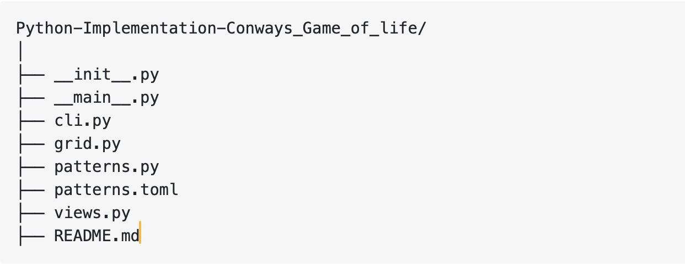

# Conways Game of life
The Game of Life is a cellular automaton created by John H. Conway in 1970. The game is a zero-player game in which an initially configured 2D grid of cells evolves according to the Game of Life [ruleset](https://en.wikipedia.org/wiki/Conway%27s_Game_of_Life).

Built using Python 3.14.0, this implementation of Conway's Game of Life allows the user to easily run the Game of Life using a 2D grid of choosen number of rows and columns in either a MacOS or Windows terminal/console.

This project is licensed under the terms of the MIT license.

# Ruleset
Using the following ruleset the 2D grid of cells will evolve from generation to generation until it reaches a static state of either all dead cells or a mix of still, oscillating, or moving (spaceship) cells.

1. **Underpopulation** - If a live cell has is surrounded by less than two surrounding neighbours it dies and does not make it to the next generation.
2. **Equilibrium** - If a live cell is surrounded by two or three living neighbors the cell stays alive and makes it to the next generation.
3. **Overpopulation** - If a live cell is surrounded by more than three living neighbors the cell dies and does not make it to the next generation.
4. **Reproduction** - If a dead cell is surrounded by three living neighbors the cell stays alive and makes it to the next generation.

# Dependancies

***Python*** : High-level, interpreted programming language known for its simplicity, readability, and versatility across web development, data science, automation, and AI.

***TOML*** : Minimal configuration file format that’s convenient to read and parse and primarily used for configuration, separating code from settings for flexibility.

***Visual Studio Code*** : Primary code editor used for development.

# Project Structure
Every time you start a new Python project, you should take some time to think about how you’ll organize the project itself. You need to create your project layout, which is the directory structure of your project.

For a Python project that implements Conway’s Game of Life, you may end up with many different layouts. So, it’s best to think of what you want to or need to do first. Here’s a summary:

* Implement the Game of Life algorithm, including the life grid and the seeds or patterns
* Provide a way to visualize the life grid and its evolution
* Allow the user to set a pattern and run the game a given number of generations
Following these ideas, you’ll create the following directory structure for your Game of Life project:

